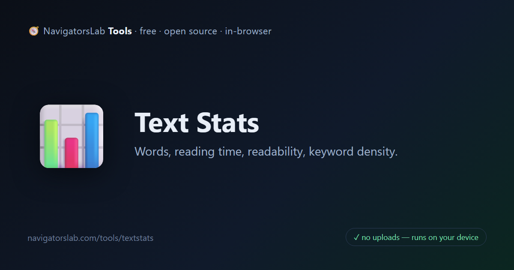
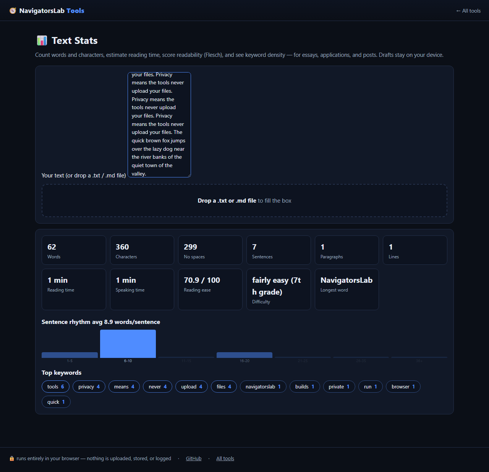

# 📊 Text Stats

> Words, reading time, readability, keyword density

     

<h4 align="center">
  &#9654; <a href="https://navigatorslab.com/tools/textstats.html">Open it on navigatorslab.com</a> &mdash; free, no sign-up, nothing uploaded 
  <a href="https://navigatorslab.com/Text-Stats">navigatorslab.com/Text-Stats</a> &middot; same tool, shorter URL 
  This repo's Pages site runs the <em>actual tool</em>: <code>demo.html</code>
</h4>

Words, reading time, Flesch reading-ease, keyword density and a sentence-length rhythm histogram.

## ✅ What it does

- Words, characters, sentences, reading and speaking time
- Flesch reading-ease with grade level, plus keyword density
- Live sentence-rhythm histogram

## 🚀 Try it in 30 seconds

1. Paste the text
2. Get words, Flesch grade and keyword density
3. Watch the sentence-rhythm histogram

## 📸 See it in action

## 🔒 Private by design

- **100% on-device** — files are processed in your browser and **never uploaded** to any server
- **No accounts, no tracking, no cookies, nothing retained** — open the page and work
- **Works offline** once loaded; fully mobile-friendly
- **Free & open source (MIT)** — use it at home, at work, anywhere

## 🤖 Built for humans *and* AI agents

- Deep-linkable via URL parameters — see the [Agent Mode guide](https://navigatorslab.com/tools/agents.html)
- Machine-readable catalog: [llms.txt](https://navigatorslab.com/tools/llms.txt) · [llms-full.txt](https://navigatorslab.com/tools/llms-full.txt)
- MCP endpoint: `POST https://navigatorslab.com/tools/mcp` (tool catalog + deterministic text tools — see the [main repo](https://github.com/Kayforkind/NavigatorsLab-Tools))
- No build step required to *use* any tool — just the URL

## 🛠 Under the hood

Pure TypeScript: Flesch reading-ease, keyword density, rhythm histogram

Third-party components are catalogued in [NOTICE](NOTICE); this repo is MIT-licensed ([LICENSE](LICENSE)).

## 🗂 The NavigatorsLab Tools suite

The full catalog — every tool in the hub with the same zero-upload promise, plus the lab's apps, CLIs and engines:

| Tool | What it does | |
|---|---|---|
| 🛡 Photo Privacy Kit | Strip GPS, camera model and timestamps before posting | [Open](https://navigatorslab.com/tools/exif.html) |
| 🔍 Metadata & Hidden-Data Checker | See what's really inside a file — then strip it | [Open](https://navigatorslab.com/tools/metadata.html) |
| 🗜 Image Shrinker | Hit “max 2 MB” portal limits without TinyPNG | [Open](https://navigatorslab.com/tools/shrink.html) |
| 📄 Scan & Screenshot Cleaner | Phone photos of documents → clean, straight PDFs | [Open](https://navigatorslab.com/tools/scan.html) |
| ✍ Local E-Sign Pad | Sign this lease tonight — not DocuSign | [Open](https://navigatorslab.com/tools/sign.html) |
| 🧾 Receipts → One PDF | Shoebox of receipt photos → one date-sorted PDF | [Open](https://navigatorslab.com/tools/receipts.html) |
| 🔢 Receipt OCR → CSV | Read totals off receipt photos, export for expenses | [Open](https://navigatorslab.com/tools/ocr.html) |
| 🔳 QR Studio | Generate QR codes and decode QR images — no site sees them | [Open](https://navigatorslab.com/tools/qr.html) |
| 🎧 Audio Trimmer | Cut voice notes and clips on a waveform | [Open](https://navigatorslab.com/tools/audio.html) |
| 🧮 Invoice / Quote Generator | One-person shops: hours in, clean PDF out | [Open](https://navigatorslab.com/tools/invoice.html) |
| 🗂 Batch Rename & Sort | IMG_5847.jpg → 2026-09-05-receipt-home-depot.jpg | [Open](https://navigatorslab.com/tools/rename.html) |
| 🖨 Print-Shop Prep | Exact sizes, bleed, DPI checks, print-ready PDF | [Open](https://navigatorslab.com/tools/printprep.html) |
| 📑 PDF Pages | Reorder, rotate, delete and extract PDF pages | [Open](https://navigatorslab.com/tools/pdfpages.html) |
| 🔬 Text Diff | Compare two texts with word-level highlights | [Open](https://navigatorslab.com/tools/textdiff.html) |
| 🎨 Reimagine | Redesign any HTML page from its own content | [Open](https://navigatorslab.com/reimagine/) |
| **📊 Text Stats** | Words, reading time, readability, keyword density | [Open](https://navigatorslab.com/tools/textstats.html) |
| 📜 PDF Studio | Edit the text inside your PDF — private, free, open source | [Open](https://navigatorslab.com/pdf-studio/) |
| 🩺 Design Health | 18 deterministic design-quality checks for HTML — no LLM, no API key | [Open](https://github.com/Kayforkind/design-health-action) |
| 🔪 Skill Slice | Copy one Read-verified skill folder — a slice, not the pie | [Open](https://github.com/Kayforkind/skill-slice) |
| 🕵 liecatchers | Your agent said Done. Prove it — ten sensors, one RECEIPT.json | [Open](https://github.com/Kayforkind/liecatchers) |
| 📚 Book Guide MCP | Ship improvements with your books — agents cite, run playbooks, learn | [Open](https://github.com/Kayforkind/book-guide-mcp) |
| 📡 Data Insights | Founder intelligence — daily & weekly tech signal briefs | [Open](https://github.com/Kayforkind/data-insights) |
| 🪓 Iron Axe: Legacy | An original side-scrolling beat 'em up — Godot 4 | [Open](https://github.com/Kayforkind/iron-axe-legacy) |

---

  <b>One hub, fifteen tools:</b> <a href="https://navigatorslab.com/tools/">https://navigatorslab.com/tools</a> 
  <b>Source &amp; the whole suite:</b> <a href="https://github.com/Kayforkind/NavigatorsLab-Tools">https://github.com/Kayforkind/NavigatorsLab-Tools</a>

